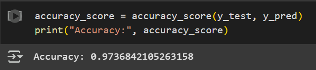

# 🎗️ Breast Cancer Prediction Model

A machine learning project that uses **logistic regression** to predict whether a breast tumor is **malignant or benign** based on medical features. Built with `scikit-learn`, this model leverages preprocessing, scaling, and performance evaluation to ensure reliable predictions.

---

## 📌 Overview

This project includes:
- Cleaned Breast Cancer dataset
- Feature scaling using StandardScaler
- Logistic Regression model
- Evaluation using accuracy, confusion matrix, and classification report

---
## 🤖 Why Logistic Regression?
Logistic Regression was chosen for this breast cancer prediction model because it is well-suited for binary classification tasks, where the goal is to predict one of two possible outcomes: malignant or benign. It provides a simple, interpretable approach to modeling the relationship between input features and the target variable.

Additionally, Logistic Regression is computationally efficient and performs well on small to medium-sized datasets like the breast cancer dataset. Its ease of use, along with regularization techniques that help prevent overfitting, makes it an ideal choice for this task.

---

## ✅ Model Accuracy

